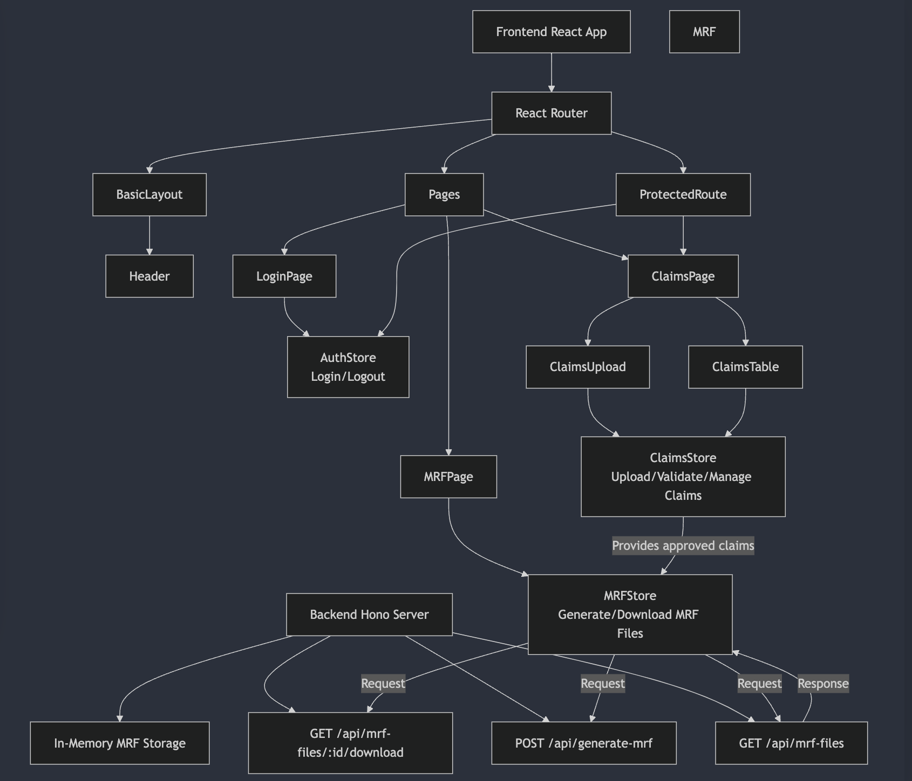

# Architecture

This application is a healthcare claims management and MRF generation system. It allows users to upload, validate, and manage healthcare claims data and generate MRF files for healthcare price transparency compliance.

## Overview

This application is a healthcare claims management and MRF generation system. It allows users to upload, validate, and manage healthcare claims data and generate MRF files for healthcare price transparency compliance. We use React and TypeScript for the frontend, with Mantine UI components and MobX for state management. The backend is built on Hono.js. Data validation is handled via Zod schemas. A Mermaid diagram is included below. We also include some basic unit tests.

## Application Flow

### Authentication Flow
Users log in through the `/login` route where their credentials are validated by the `authStore`. Once authenticated, users can access protected routes, which otherwise prevent unauthorized access and redirect to the login page.

### Claims Management Flow
Users upload CSV files containing claims data. This data is parsed and validated against the `claimSchema`. Valid claims appear in the `ClaimsTable` component where users can edit, delete, or approve them. Approved claims can then be used to generate MRF files. Basic tests are included for this component.

### MRF Generation Flow
When ready, approved claims are sent to the backend where they're processed into the required MRF format. These generated files are stored and made available for download through the user interface.

## Components and Responsibilities

### Layout Components
The **BasicLayout** serves as the main wrapper with header and content areas. The **Header** provides navigation and user controls.

### Authentication Components
The system includes a **LoginPage** for user authentication and a **ProtectedRoute** that restricts access to authenticated users only.

### Claims Management Components
Claims management is handled by the **ClaimsUpload** component for CSV file uploads and validation, and the **ClaimsTable** component, which provides an interactive table. The table enables deletion of claims, shows validation errors, and handles the claim approval process. The table should also be editable in theory, i.e. all the machinery is present but there is a minor bug I've been unable to trace which I'm very sure I could fix if I spent a little more time on it.

### MRF Components
The **MrfFilesPage** lists available MRF files and allows generation of new ones. It displays file metadata such as name, date, and size, while providing download functionality.

## State Management

The application uses MobX for reactive state management with three main stores:

### `authStore`
This store manages authentication state including login status and username. It handles login/logout operations and tracks authentication errors and loading states.

### `claimsStore`
The claims store maintains arrays of claims data, handles CSV parsing and validation, and manages claim operations such as updates, deletions, and clearance. It also tracks validation errors and manages the approval process.

### `mrfStore`
This store manages MRF file metadata, handles backend communication for MRF operations, implements download functionality, and tracks loading states and errors.

## UI Framework

The interface is built with Mantine UI components. AG Grid and Tailwind CSS are used as outlined in the instructions. I used a color picker to find and integrate the exact green found on the Clearest Health website.
## Data Validation

The application implements data validation using Zod schemas. The **claimSchema** defines the structure and constraints for claims data, while the **mrfSchema** defines the structure of MRF files. I used the sample csv file in the data folder as a guide for the schema. I chose this file over the one in the frontend directory because it contains more columns and is likely more represenative of real-world data.

## Backend API Interaction

The `/api/mrf-files` GET endpoint lists available MRF files. The `/api/generate-mrf` POST endpoint generates new MRF files from claims data. The `/api/mrf-files/:id/download` GET endpoint enables downloading specific MRF files. The backend processes claims data to generate standardized MRF files according to TiC regulations.

## Routing and Navigation

React Router handles navigation across the main routes: the landing page at `/`, authentication at `/login`, claims management at `/claims` (protected), and MRF files management at `/mrf-files`. Navigation occurs through direct links in the Header component, programmatic navigation using the `useNavigate()` hook, and automatic redirects based on authentication state.